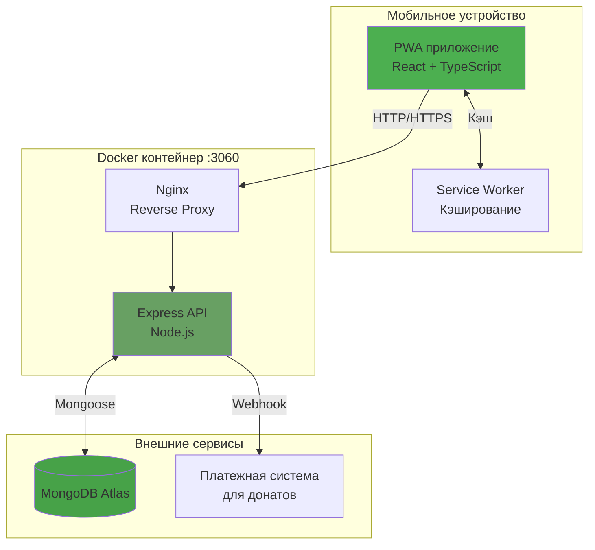

# Документ проектирования: Узбек Варс

## Обзор

Узбек Варс - это мобильная веб-игра в жанре симулятора выживания с узбекской культурной эстетикой. Игра разработана по принципу mobile-first и оптимизирована для смартфонов (iPhone и Android). Игроки выбирают персонажа-узбека, выполняют различные активности для заработка узбекских сомов и опыта, прокачивают своего персонажа и погружаются в атмосферу узбекской культуры.

Приложение реализовано как Progressive Web App (PWA) с возможностью установки на домашний экран и работы в офлайн-режиме. Архитектура спроектирована так, чтобы в будущем легко обернуть приложение в Capacitor для публикации в App Store и Google Play.

## Архитектура

### Технологический стек

**Frontend:**
- React 18+ с TypeScript для типобезопасности
- Vite для быстрой сборки и разработки
- TailwindCSS для mobile-first адаптивного дизайна
- Framer Motion для плавных анимаций
- React Query для управления состоянием сервера
- i18next для мультиязычности (ru, uz, uk, en)

**Backend:**
- Node.js с Express.js
- MongoDB Atlas для хранения данных
- Mongoose для работы с MongoDB
- JWT для аутентификации пользователей

**PWA и мобильная оптимизация:**
- Workbox для Service Worker
- Web App Manifest для установки на домашний экран
- Capacitor (подготовка для будущей нативной версии)

**Инфраструктура:**
- Docker для контейнеризации
- Docker Compose для оркестрации
- Nginx для проксирования на порт 3060


### Архитектурная диаграмма



### Слои приложения

1. **Presentation Layer (UI)** - React компоненты, мобильный интерфейс
2. **State Management Layer** - React Query, Context API
3. **Business Logic Layer** - Хуки и сервисы
4. **API Layer** - REST API endpoints
5. **Data Access Layer** - Mongoose модели и схемы
6. **Database Layer** - MongoDB Atlas

## Компоненты и интерфейсы

### Frontend компоненты

#### 1. CharacterSelection (Выбор персонажа)

Компонент для выбора персонажа при первом запуске игры.

```typescript
interface Character {
  id: string;
  name: string;
  avatar: string;
  description: string;
  startingStats: {
    level: number;
    experience: number;
    soms: number;
  };
}

interface CharacterSelectionProps {
  characters: Character[];
  onSelect: (characterId: string) => Promise<void>;
}
```

**Мобильная оптимизация:**
- Карточки персонажей занимают 90% ширины экрана
- Свайп для переключения между персонажами
- Большие области нажатия (минимум 44x44px)
- Анимация появления карточек

#### 2. GameDashboard (Главный экран игры)

Основной экран с информацией о персонаже и доступными активностями.

```typescript
interface PlayerState {
  characterId: string;
  level: number;
  experience: number;
  experienceToNextLevel: number;
  soms: number;
  selectedLanguage: string;
}

interface GameDashboardProps {
  playerState: PlayerState;
  activities: Activity[];
  onActivitySelect: (activityId: string) => void;
}
```

**Мобильный layout:**
- Sticky header с информацией о персонаже
- Прогресс-бар опыта во всю ширину
- Сетка активностей 2 колонки на мобильных
- Bottom navigation для быстрого доступа

#### 3. ActivityCard (Карточка активности)

Отображает доступную активность с анимацией.

```typescript
interface Activity {
  id: string;
  name: string;
  icon: string;
  description: string;
  rewards: {
    experience: number;
    soms: number;
  };
  risks: {
    probability: number;
    penalty: number;
  };
  cooldown: number;
  requiredLevel: number;
}

interface ActivityCardProps {
  activity: Activity;
  isAvailable: boolean;
  onExecute: () => void;
}
```


#### 4. ProgressBar (Прогресс-бар)

Анимированный прогресс-бар для отображения опыта.

```typescript
interface ProgressBarProps {
  current: number;
  max: number;
  label?: string;
  animated?: boolean;
  color?: string;
}
```

#### 5. LanguageSwitcher (Переключатель языков)

Компонент для переключения между 4 языками.

```typescript
type Language = 'ru' | 'uz' | 'uk' | 'en';

interface LanguageSwitcherProps {
  currentLanguage: Language;
  onLanguageChange: (lang: Language) => void;
}
```

#### 6. DonationModal (Модальное окно донатов)

Модальное окно для совершения доната.

```typescript
interface DonationOption {
  amount: number;
  bonus: {
    soms: number;
    experience: number;
  };
}

interface DonationModalProps {
  isOpen: boolean;
  options: DonationOption[];
  onClose: () => void;
  onDonate: (amount: number) => Promise<void>;
}
```

### Backend API endpoints

#### Аутентификация и пользователи

```typescript
// POST /api/auth/google
interface GoogleAuthRequest {
  idToken: string;
  ipAddress: string;
  deviceInfo: {
    userAgent: string;
    platform: string;
    deviceId: string;
  };
  referralCode?: string;
}

interface GoogleAuthResponse {
  token: string;
  user: User;
  isNewUser: boolean;
}

// POST /api/auth/dev-login (только для разработки)
interface DevLoginRequest {
  username: string;
  password: string;
}

interface DevLoginResponse {
  token: string;
  user: User;
}
```

#### Персонажи и города

```typescript
// GET /api/characters
interface GetCharactersResponse {
  characters: Character[];
}

// GET /api/cities
interface GetCitiesResponse {
  cities: City[];
}

// POST /api/player/select-character
interface SelectCharacterRequest {
  characterId: string;
  cityId: string;
}

interface SelectCharacterResponse {
  player: Player;
}
```


#### Игровой процесс

```typescript
// GET /api/player/state
interface GetPlayerStateResponse {
  player: Player;
  activities: Activity[];
}

// POST /api/activities/execute
interface ExecuteActivityRequest {
  activityId: string;
}

interface ExecuteActivityResponse {
  success: boolean;
  result: {
    experienceGained: number;
    somsGained: number;
    levelUp: boolean;
    newLevel?: number;
    penalty?: {
      type: string;
      amount: number;
    };
  };
  updatedPlayer: Player;
}

// PATCH /api/player/language
interface UpdateLanguageRequest {
  language: Language;
}
```

#### Донаты

```typescript
// POST /api/donations/create
interface CreateDonationRequest {
  amount: number;
}

interface CreateDonationResponse {
  paymentUrl: string;
  donationId: string;
}

// POST /api/donations/webhook
// Webhook от платежной системы
interface DonationWebhook {
  donationId: string;
  status: 'success' | 'failed';
  amount: number;
}
```

#### Косметические предметы

```typescript
// GET /api/cosmetics
interface GetCosmeticsResponse {
  items: CosmeticItem[];
}

// POST /api/cosmetics/purchase
interface PurchaseCosmeticRequest {
  itemId: string;
}

interface PurchaseCosmeticResponse {
  success: boolean;
  item: CosmeticItem;
  remainingCurrency: number;
}

// POST /api/cosmetics/equip
interface EquipCosmeticRequest {
  itemId: string;
  type: 'clothing' | 'background';
}
```

#### Рейтинги

```typescript
// GET /api/leaderboard/global
interface GetGlobalLeaderboardResponse {
  leaderboard: Array<{
    rank: number;
    player: {
      displayName: string;
      level: number;
      soms: number;
      cityId: string;
    };
  }>;
  currentPlayerRank?: number;
}

// GET /api/leaderboard/city/:cityId
interface GetCityLeaderboardResponse {
  leaderboard: Array<{
    rank: number;
    player: {
      displayName: string;
      level: number;
      soms: number;
    };
  }>;
  currentPlayerRank?: number;
}
```

#### Реферальная система

```typescript
// GET /api/referral/code
interface GetReferralCodeResponse {
  referralCode: string;
  referralUrl: string;
  referredCount: number;
}

// GET /api/referral/referred
interface GetReferredPlayersResponse {
  players: Array<{
    displayName: string;
    level: number;
    joinedAt: Date;
  }>;
}
```

## Модели данных

### User (Пользователь)

```typescript
interface User {
  _id: string;
  googleId: string;
  email: string;
  displayName: string;
  avatar: string;
  language: Language;
  ipAddress: string;
  deviceInfo: {
    userAgent: string;
    platform: string;
    deviceId: string;
  };
  createdAt: Date;
  updatedAt: Date;
}
```

**MongoDB схема:**
```javascript
const UserSchema = new Schema({
  googleId: { type: String, required: true, unique: true, index: true },
  email: { type: String, required: true, unique: true },
  displayName: { type: String, required: true },
  avatar: { type: String },
  language: { type: String, enum: ['ru', 'uz', 'uk', 'en'], default: 'ru' },
  ipAddress: { type: String, index: true },
  deviceInfo: {
    userAgent: { type: String },
    platform: { type: String },
    deviceId: { type: String, index: true },
  },
}, { timestamps: true });
```


### Player (Игрок)

```typescript
interface Player {
  _id: string;
  userId: string;
  characterId: string;
  cityId: string;
  level: number;
  experience: number;
  soms: number;
  donationCurrency: number; // Кристаллы/алмазы
  stats: {
    hunger: number; // 0-100
    health: number; // 0-100
    mood: number; // 0-100
    energy: number; // 0-100
  };
  cosmetics: {
    clothing: string[];
    backgrounds: string[];
    activeClothing?: string;
    activeBackground?: string;
  };
  referralCode: string;
  referredBy?: string;
  lastActivityTime: Date;
  createdAt: Date;
  updatedAt: Date;
}
```

**MongoDB схема:**
```javascript
const PlayerSchema = new Schema({
  userId: { type: Schema.Types.ObjectId, ref: 'User', required: true, unique: true, index: true },
  characterId: { type: String, required: true },
  cityId: { type: String, required: true, index: true },
  level: { type: Number, default: 1, min: 1, index: true },
  experience: { type: Number, default: 0, min: 0 },
  soms: { type: Number, default: 100, min: 0, index: true },
  donationCurrency: { type: Number, default: 0, min: 0 },
  stats: {
    hunger: { type: Number, default: 100, min: 0, max: 100 },
    health: { type: Number, default: 100, min: 0, max: 100 },
    mood: { type: Number, default: 100, min: 0, max: 100 },
    energy: { type: Number, default: 100, min: 0, max: 100 },
  },
  cosmetics: {
    clothing: [{ type: String }],
    backgrounds: [{ type: String }],
    activeClothing: { type: String },
    activeBackground: { type: String },
  },
  referralCode: { type: String, required: true, unique: true, index: true },
  referredBy: { type: String, index: true },
  lastActivityTime: { type: Date, default: Date.now },
}, { timestamps: true });
```

### Donation (Донат)

```typescript
interface Donation {
  _id: string;
  userId: string;
  amount: number;
  donationCurrencyAwarded: number;
  status: 'pending' | 'success' | 'failed';
  paymentId: string;
  bonusApplied: boolean;
  createdAt: Date;
  updatedAt: Date;
}
```

**MongoDB схема:**
```javascript
const DonationSchema = new Schema({
  userId: { type: Schema.Types.ObjectId, ref: 'User', required: true, index: true },
  amount: { type: Number, required: true, min: 0 },
  donationCurrencyAwarded: { type: Number, required: true, min: 0 },
  status: { type: String, enum: ['pending', 'success', 'failed'], default: 'pending' },
  paymentId: { type: String, required: true },
  bonusApplied: { type: Boolean, default: false },
}, { timestamps: true });
```

### City (Город)

```typescript
interface City {
  _id: string;
  cityId: string;
  name: {
    ru: string;
    uz: string;
    uk: string;
    en: string;
  };
  playerCount: number;
  maxPlayers: number;
  isOpen: boolean;
  theme: {
    primaryColor: string;
    backgroundImage: string;
    description: string;
  };
}
```

**MongoDB схема:**
```javascript
const CitySchema = new Schema({
  cityId: { type: String, required: true, unique: true },
  name: {
    ru: { type: String, required: true },
    uz: { type: String, required: true },
    uk: { type: String, required: true },
    en: { type: String, required: true },
  },
  playerCount: { type: Number, default: 0, min: 0 },
  maxPlayers: { type: Number, required: true },
  isOpen: { type: Boolean, default: true },
  theme: {
    primaryColor: { type: String },
    backgroundImage: { type: String },
    description: { type: String },
  },
});
```

### CosmeticItem (Косметический предмет)

```typescript
interface CosmeticItem {
  _id: string;
  itemId: string;
  type: 'clothing' | 'background';
  name: {
    ru: string;
    uz: string;
    uk: string;
    en: string;
  };
  description: {
    ru: string;
    uz: string;
    uk: string;
    en: string;
  };
  price: number; // В донатной валюте
  imageUrl: string;
  rarity: 'common' | 'rare' | 'epic' | 'legendary';
}
```

**MongoDB схема:**
```javascript
const CosmeticItemSchema = new Schema({
  itemId: { type: String, required: true, unique: true },
  type: { type: String, enum: ['clothing', 'background'], required: true },
  name: {
    ru: { type: String, required: true },
    uz: { type: String, required: true },
    uk: { type: String, required: true },
    en: { type: String, required: true },
  },
  description: {
    ru: { type: String },
    uz: { type: String },
    uk: { type: String },
    en: { type: String },
  },
  price: { type: Number, required: true, min: 0 },
  imageUrl: { type: String, required: true },
  rarity: { type: String, enum: ['common', 'rare', 'epic', 'legendary'], default: 'common' },
});
```

### ActivityLog (Лог активностей)

```typescript
interface ActivityLog {
  _id: string;
  userId: string;
  activityId: string;
  experienceGained: number;
  somsGained: number;
  penaltyApplied: boolean;
  timestamp: Date;
}
```

**MongoDB схема:**
```javascript
const ActivityLogSchema = new Schema({
  userId: { type: Schema.Types.ObjectId, ref: 'User', required: true, index: true },
  activityId: { type: String, required: true },
  experienceGained: { type: Number, default: 0 },
  somsGained: { type: Number, default: 0 },
  penaltyApplied: { type: Boolean, default: false },
  timestamp: { type: Date, default: Date.now, index: true },
});
```


## Игровая механика

### Система прогрессии

**Формула расчета опыта для следующего уровня:**
```typescript
function calculateExperienceForLevel(level: number): number {
  return Math.floor(100 * Math.pow(1.5, level - 1));
}
```

Примеры:
- Уровень 1 → 2: 100 опыта
- Уровень 2 → 3: 150 опыта
- Уровень 3 → 4: 225 опыта
- Уровень 5 → 6: 506 опыта

**Проверка повышения уровня:**
```typescript
function checkLevelUp(player: Player): { levelUp: boolean; newLevel?: number } {
  const requiredExp = calculateExperienceForLevel(player.level);
  
  if (player.experience >= requiredExp) {
    return {
      levelUp: true,
      newLevel: player.level + 1
    };
  }
  
  return { levelUp: false };
}
```

### Игровые активности

**Предопределенные активности:**

1. **Работать в Связном**
   - Награда: 50 опыта, 200 сомов
   - Риск: 0% (безопасная активность)
   - Требуемый уровень: 1
   - Cooldown: 30 секунд

2. **Грабить**
   - Награда: 150 опыта, 500 сомов
   - Риск: 30% потерять 300 сомов
   - Требуемый уровень: 3
   - Cooldown: 60 секунд

3. **Готовить плов**
   - Награда: 80 опыта, 300 сомов
   - Риск: 10% потерять 100 сомов (сгорел плов)
   - Требуемый уровень: 2
   - Cooldown: 45 секунд

4. **Торговать на базаре**
   - Награда: 100 опыта, 400 сомов
   - Риск: 20% потерять 200 сомов
   - Требуемый уровень: 4
   - Cooldown: 50 секунд

**Выполнение активности:**
```typescript
async function executeActivity(
  player: Player, 
  activity: Activity
): Promise<ActivityResult> {
  // Проверка доступности
  if (player.level < activity.requiredLevel) {
    throw new Error('Level too low');
  }
  
  // Проверка cooldown
  const timeSinceLastActivity = Date.now() - player.lastActivityTime.getTime();
  if (timeSinceLastActivity < activity.cooldown * 1000) {
    throw new Error('Activity on cooldown');
  }
  
  // Расчет результата
  let experienceGained = activity.rewards.experience;
  let somsGained = activity.rewards.soms;
  let penaltyApplied = false;
  
  // Проверка риска
  if (activity.risks && Math.random() < activity.risks.probability) {
    somsGained -= activity.risks.penalty;
    penaltyApplied = true;
  }
  
  // Обновление игрока
  player.experience += experienceGained;
  player.soms = Math.max(0, player.soms + somsGained);
  player.lastActivityTime = new Date();
  
  // Проверка повышения уровня
  const levelUpResult = checkLevelUp(player);
  if (levelUpResult.levelUp) {
    player.level = levelUpResult.newLevel!;
    player.experience = 0;
  }
  
  await player.save();
  
  return {
    success: true,
    experienceGained,
    somsGained,
    levelUp: levelUpResult.levelUp,
    newLevel: levelUpResult.newLevel,
    penaltyApplied
  };
}
```


### Система донатов

**Опции донатов (донатная валюта - кристаллы):**

```typescript
const DONATION_OPTIONS = [
  {
    amount: 100, // рублей
    crystals: 100
  },
  {
    amount: 500,
    crystals: 550 // +10% бонус
  },
  {
    amount: 1000,
    crystals: 1200 // +20% бонус
  },
  {
    amount: 5000,
    crystals: 6500 // +30% бонус
  }
];
```

**Обработка доната:**
```typescript
async function processDonation(userId: string, donationId: string): Promise<void> {
  const donation = await Donation.findById(donationId);
  
  if (!donation || donation.bonusApplied) {
    return;
  }
  
  const player = await Player.findOne({ userId });
  const option = DONATION_OPTIONS.find(o => o.amount === donation.amount);
  
  if (option) {
    player.donationCurrency += option.crystals;
    await player.save();
    
    donation.donationCurrencyAwarded = option.crystals;
    donation.bonusApplied = true;
    await donation.save();
  }
}
```

### Система городов

**Города:**

```typescript
const CITIES = [
  {
    cityId: 'samarkand',
    name: {
      ru: 'Самарканд',
      uz: 'Samarqand',
      uk: 'Самарканд',
      en: 'Samarkand'
    },
    maxPlayers: 1000,
    theme: {
      primaryColor: '#4A90E2',
      backgroundImage: '/assets/cities/samarkand.jpg',
      description: 'Древний город на Великом шелковом пути'
    }
  },
  {
    cityId: 'shymkent',
    name: {
      ru: 'Шымкент',
      uz: 'Shymkent',
      uk: 'Шимкент',
      en: 'Shymkent'
    },
    maxPlayers: 1000,
    theme: {
      primaryColor: '#E24A4A',
      backgroundImage: '/assets/cities/shymkent.jpg',
      description: 'Южная столица Казахстана'
    }
  },
  {
    cityId: 'tashkent',
    name: {
      ru: 'Ташкент',
      uz: 'Toshkent',
      uk: 'Ташкент',
      en: 'Tashkent'
    },
    maxPlayers: 1000,
    theme: {
      primaryColor: '#50C878',
      backgroundImage: '/assets/cities/tashkent.jpg',
      description: 'Столица Узбекистана'
    }
  },
  {
    cityId: 'bukhara',
    name: {
      ru: 'Бухара',
      uz: 'Buxoro',
      uk: 'Бухара',
      en: 'Bukhara'
    },
    maxPlayers: 1000,
    theme: {
      primaryColor: '#DAA520',
      backgroundImage: '/assets/cities/bukhara.jpg',
      description: 'Священный город Средней Азии'
    }
  }
];
```

**Балансировка городов:**

```typescript
async function getCityAvailability(): Promise<City[]> {
  const cities = await City.find();
  
  // Обновляем статус открытости городов
  for (const city of cities) {
    const playerCount = await Player.countDocuments({ cityId: city.cityId });
    city.playerCount = playerCount;
    
    // Закрываем город если достигнут лимит
    if (playerCount >= city.maxPlayers) {
      city.isOpen = false;
    } else {
      city.isOpen = true;
    }
    
    await city.save();
  }
  
  // Если все города закрыты, открываем город с минимальным количеством игроков
  const openCities = cities.filter(c => c.isOpen);
  if (openCities.length === 0) {
    const cityWithMinPlayers = cities.reduce((min, city) => 
      city.playerCount < min.playerCount ? city : min
    );
    cityWithMinPlayers.isOpen = true;
    await cityWithMinPlayers.save();
  }
  
  return cities;
}
```

### Расширенная система прогрессии (Тамагочи)

**Обновление шкал:**

```typescript
interface StatModifiers {
  hunger?: number;
  health?: number;
  mood?: number;
  energy?: number;
}

function updatePlayerStats(player: Player, modifiers: StatModifiers): void {
  // Применяем модификаторы
  if (modifiers.hunger) {
    player.stats.hunger = Math.max(0, Math.min(100, player.stats.hunger + modifiers.hunger));
  }
  if (modifiers.health) {
    player.stats.health = Math.max(0, Math.min(100, player.stats.health + modifiers.health));
  }
  if (modifiers.mood) {
    player.stats.mood = Math.max(0, Math.min(100, player.stats.mood + modifiers.mood));
  }
  if (modifiers.energy) {
    player.stats.energy = Math.max(0, Math.min(100, player.stats.energy + modifiers.energy));
  }
}

// Пассивное снижение шкал со временем
async function applyPassiveDecay(player: Player): Promise<void> {
  const now = Date.now();
  const lastActivity = player.lastActivityTime.getTime();
  const hoursPassed = (now - lastActivity) / (1000 * 60 * 60);
  
  // Снижение на 5 единиц в час
  const decay = Math.floor(hoursPassed * 5);
  
  updatePlayerStats(player, {
    hunger: -decay,
    energy: -decay,
    mood: -Math.floor(decay * 0.5)
  });
  
  // Критические штрафы
  if (player.stats.hunger < 20) {
    player.stats.health = Math.max(0, player.stats.health - 10);
  }
  if (player.stats.energy < 20) {
    player.stats.mood = Math.max(0, player.stats.mood - 10);
  }
}
```

**Обновленные активности с влиянием на шкалы:**

```typescript
const ACTIVITIES_WITH_STATS = [
  {
    id: 'work_svyaznoy',
    name: 'Работать в Связном',
    rewards: { experience: 50, soms: 200 },
    statModifiers: { energy: -15, mood: -5, hunger: -10 },
    requiredLevel: 1,
    cooldown: 30
  },
  {
    id: 'rob',
    name: 'Грабить',
    rewards: { experience: 150, soms: 500 },
    risks: { probability: 0.3, penalty: 300 },
    statModifiers: { energy: -25, mood: -15, hunger: -15, health: -10 },
    requiredLevel: 3,
    cooldown: 60
  },
  {
    id: 'cook_plov',
    name: 'Готовить плов',
    rewards: { experience: 80, soms: 300 },
    risks: { probability: 0.1, penalty: 100 },
    statModifiers: { hunger: +30, mood: +20, energy: -10 },
    requiredLevel: 2,
    cooldown: 45
  },
  {
    id: 'rest',
    name: 'Отдохнуть',
    rewards: { experience: 10, soms: 0 },
    statModifiers: { energy: +40, mood: +15 },
    requiredLevel: 1,
    cooldown: 20
  },
  {
    id: 'eat',
    name: 'Поесть',
    rewards: { experience: 5, soms: -50 },
    statModifiers: { hunger: +50, health: +10, mood: +10 },
    requiredLevel: 1,
    cooldown: 15
  }
];
```

### Реферальная система

**Генерация реферального кода:**

```typescript
function generateReferralCode(): string {
  const chars = 'ABCDEFGHIJKLMNOPQRSTUVWXYZ0123456789';
  let code = '';
  for (let i = 0; i < 8; i++) {
    code += chars.charAt(Math.floor(Math.random() * chars.length));
  }
  return code;
}
```

**Обработка регистрации по реферальной ссылке:**

```typescript
async function handleReferralRegistration(
  newUserId: string,
  referralCode?: string
): Promise<void> {
  if (!referralCode) return;
  
  // Находим пригласившего игрока
  const referrer = await Player.findOne({ referralCode });
  if (!referrer) return;
  
  // Создаем нового игрока в том же городе
  const newPlayer = await Player.create({
    userId: newUserId,
    cityId: referrer.cityId,
    referredBy: referralCode,
    referralCode: generateReferralCode()
  });
  
  // Начисляем бонус пригласившему
  referrer.donationCurrency += 50; // 50 кристаллов за реферала
  referrer.soms += 500; // 500 сомов бонус
  await referrer.save();
}
```

### Детекция твинков

```typescript
async function detectTwinks(userId: string): Promise<boolean> {
  const user = await User.findById(userId);
  
  // Проверяем по IP
  const sameIpUsers = await User.find({ 
    ipAddress: user.ipAddress,
    _id: { $ne: userId }
  });
  
  // Проверяем по deviceId
  const sameDeviceUsers = await User.find({
    'deviceInfo.deviceId': user.deviceInfo.deviceId,
    _id: { $ne: userId }
  });
  
  // Если найдены совпадения, помечаем как подозрительного
  if (sameIpUsers.length > 0 || sameDeviceUsers.length > 0) {
    // Логируем для модерации
    console.warn(`Potential twink detected: ${userId}`);
    return true;
  }
  
  return false;
}
```

## Мобильный UI/UX дизайн

### Цветовая палитра (узбекская эстетика)

```css
:root {
  /* Основные цвета */
  --primary: #D4AF37; /* Золотой */
  --secondary: #8B4513; /* Коричневый */
  --accent: #FF6B35; /* Оранжевый */
  
  /* Фоновые цвета */
  --bg-primary: #FFF8DC; /* Кремовый */
  --bg-secondary: #F5E6D3; /* Светло-бежевый */
  
  /* Текст */
  --text-primary: #2C1810; /* Темно-коричневый */
  --text-secondary: #5D4E37; /* Средне-коричневый */
  
  /* Акценты */
  --success: #4CAF50; /* Зеленый */
  --danger: #F44336; /* Красный */
  --warning: #FF9800; /* Оранжевый */
}
```

### Типографика

```css
/* Mobile-first размеры шрифтов */
body {
  font-family: 'Inter', -apple-system, BlinkMacSystemFont, sans-serif;
  font-size: 16px; /* Базовый размер для мобильных */
  line-height: 1.5;
}

h1 { font-size: 2rem; font-weight: 700; } /* 32px */
h2 { font-size: 1.5rem; font-weight: 600; } /* 24px */
h3 { font-size: 1.25rem; font-weight: 600; } /* 20px */
p { font-size: 1rem; } /* 16px */
small { font-size: 0.875rem; } /* 14px */
```


### Адаптивные точки останова

```css
/* Mobile-first подход */
/* По умолчанию: мобильные устройства (320px - 767px) */

/* Планшеты (не приоритет) */
@media (min-width: 768px) {
  /* Стили для планшетов */
}

/* Десктоп (не приоритет) */
@media (min-width: 1024px) {
  /* Стили для десктопа */
}
```

### Анимации

**Framer Motion варианты:**

```typescript
// Появление карточки
const cardVariants = {
  hidden: { opacity: 0, y: 20 },
  visible: { 
    opacity: 1, 
    y: 0,
    transition: { duration: 0.3, ease: 'easeOut' }
  }
};

// Анимация начисления сомов
const somsCounterVariants = {
  initial: { scale: 1 },
  animate: { 
    scale: [1, 1.2, 1],
    transition: { duration: 0.5 }
  }
};

// Повышение уровня
const levelUpVariants = {
  hidden: { scale: 0, opacity: 0 },
  visible: { 
    scale: 1, 
    opacity: 1,
    transition: { 
      type: 'spring',
      stiffness: 200,
      damping: 15
    }
  }
};

// Пульсация кнопки
const buttonPulseVariants = {
  idle: { scale: 1 },
  tap: { scale: 0.95 },
  hover: { scale: 1.05 }
};
```

### Компоновка экранов

**Главный экран (GameDashboard):**

```
┌─────────────────────────┐
│  [Аватар] Уровень 5     │ ← Sticky header
│  ████████░░ 450/506 XP  │ ← Прогресс-бар
│  💰 1,250 сомов         │
│  [🌐 RU] [⚙️]           │
├─────────────────────────┤
│                         │
│  ┌─────────┬─────────┐  │
│  │ Работать│ Грабить │  │ ← Сетка активностей
│  │ в Связн.│         │  │   2 колонки
│  └─────────┴─────────┘  │
│  ┌─────────┬─────────┐  │
│  │ Готовить│Торговать│  │
│  │  плов   │на базаре│  │
│  └─────────┴─────────┘  │
│                         │
│         [💎 Донат]      │
└─────────────────────────┘
```

## Мультиязычность

### Структура переводов

```typescript
// locales/ru.json
{
  "character": {
    "select": "Выберите персонажа",
    "level": "Уровень",
    "experience": "Опыт"
  },
  "currency": {
    "soms": "сомов",
    "soms_short": "с."
  },
  "activities": {
    "work_svyaznoy": "Работать в Связном",
    "rob": "Грабить",
    "cook_plov": "Готовить плов",
    "trade_bazaar": "Торговать на базаре"
  },
  "notifications": {
    "level_up": "Поздравляем! Вы достигли уровня {{level}}!",
    "activity_success": "Получено: {{exp}} опыта, {{soms}} сомов",
    "activity_penalty": "Неудача! Потеряно {{soms}} сомов"
  }
}
```

**i18next конфигурация:**
```typescript
import i18n from 'i18next';
import { initReactI18next } from 'react-i18next';

i18n
  .use(initReactI18next)
  .init({
    resources: {
      ru: { translation: ruTranslations },
      uz: { translation: uzTranslations },
      uk: { translation: ukTranslations },
      en: { translation: enTranslations }
    },
    lng: 'ru',
    fallbackLng: 'ru',
    interpolation: {
      escapeValue: false
    }
  });
```


## Свойства корректности

Свойство - это характеристика или поведение, которое должно выполняться во всех допустимых выполнениях системы - по сути, формальное утверждение о том, что система должна делать. Свойства служат мостом между человекочитаемыми спецификациями и машинно-проверяемыми гарантиями корректности.

### Property 1: Round-trip сохранения выбора персонажа

*Для любого* выбранного персонажа, сохранение выбора в базу данных и последующая загрузка должны вернуть того же персонажа с теми же начальными характеристиками.

**Validates: Requirements 1.3, 1.4**

### Property 2: Начальный уровень нового персонажа

*Для любого* нового персонажа, уровень должен быть равен 1, а опыт должен быть числом >= 0.

**Validates: Requirements 2.1, 2.2**

### Property 3: Повышение уровня при достаточном опыте

*Для любого* персонажа с опытом >= требуемого для следующего уровня, система должна повысить уровень персонажа ровно на 1 и сбросить опыт.

**Validates: Requirements 2.3**

### Property 4: Round-trip сохранения состояния игры

*Для любого* состояния персонажа (уровень, опыт, сомы, выбранный персонаж), сохранение в базу данных и последующая загрузка должны вернуть идентичное состояние.

**Validates: Requirements 2.5, 7.3, 7.4, 7.5**

### Property 5: Выполнение активности изменяет состояние

*Для любой* доступной активности, её выполнение должно изменить состояние персонажа (увеличить опыт и изменить количество сомов согласно правилам активности).

**Validates: Requirements 3.4, 3.5, 12.2**

### Property 6: Начисление сомов согласно правилам активности

*Для любой* активности, количество начисленных или списанных сомов должно соответствовать определению активности с учетом вероятности штрафа.

**Validates: Requirements 4.2, 12.3**

### Property 7: Отображение сомов с символом валюты

*Для любого* состояния персонажа, рендер интерфейса должен содержать текущее количество сомов и символ валюты.

**Validates: Requirements 4.3**

### Property 8: Round-trip сохранения количества сомов

*Для любого* количества сомов персонажа, сохранение в базу данных и загрузка должны вернуть то же значение.

**Validates: Requirements 4.4**

### Property 9: Блокировка платных активностей при недостатке сомов

*Для любой* активности, требующей оплаты, если у персонажа недостаточно сомов, система должна предотвратить выполнение активности и вернуть ошибку.

**Validates: Requirements 4.5**

### Property 10: Переключение языка изменяет все тексты

*Для любого* поддерживаемого языка (ru, uz, uk, en), переключение на этот язык должно изменить все текстовые элементы интерфейса на соответствующие переводы.

**Validates: Requirements 5.5**

### Property 11: Round-trip сохранения выбранного языка

*Для любого* выбранного языка, сохранение в базу данных и загрузка должны вернуть тот же язык.

**Validates: Requirements 5.6, 5.7**

### Property 12: Сохранение данных персонажа в MongoDB

*Для любого* персонажа, после сохранения данные должны существовать в коллекции MongoDB и быть доступны для запроса.

**Validates: Requirements 7.2**

### Property 13: Формула расчета опыта монотонно возрастает

*Для любых* двух уровней L1 и L2, где L2 > L1, требуемый опыт для L2 должен быть строго больше, чем для L1.

**Validates: Requirements 12.1**

### Property 14: Применение штрафов с заданной вероятностью

*Для любой* активности с риском, при многократном выполнении (N >= 100), частота применения штрафов должна быть в пределах ±10% от заданной вероятности.

**Validates: Requirements 12.4**

### Property 15: Уведомление при повышении уровня

*Для любого* персонажа, когда происходит повышение уровня, система должна вызвать функцию уведомления с новым уровнем.

**Validates: Requirements 2.4**

### Property 16: Отображение уровня и опыта в интерфейсе

*Для любого* состояния персонажа, рендер интерфейса должен содержать текущий уровень и текущий опыт.

**Validates: Requirements 2.6**

### Property 17: Отображение результата активности

*Для любой* выполненной активности, система должна вернуть результат с информацией о полученном опыте и сомах.

**Validates: Requirements 3.6**


## Обработка ошибок

### Категории ошибок

**1. Ошибки валидации (400 Bad Request)**
- Недостаточно сомов для выполнения активности
- Уровень персонажа слишком низкий для активности
- Активность на cooldown
- Невалидные данные в запросе

```typescript
class ValidationError extends Error {
  constructor(message: string, public code: string) {
    super(message);
    this.name = 'ValidationError';
  }
}

// Пример использования
if (player.soms < activity.cost) {
  throw new ValidationError(
    'Insufficient soms',
    'INSUFFICIENT_SOMS'
  );
}
```

**2. Ошибки аутентификации (401 Unauthorized)**
- Невалидный или истекший JWT токен
- Отсутствие токена

```typescript
class AuthenticationError extends Error {
  constructor(message: string) {
    super(message);
    this.name = 'AuthenticationError';
  }
}
```

**3. Ошибки базы данных (500 Internal Server Error)**
- Ошибка подключения к MongoDB
- Ошибка выполнения запроса
- Таймаут операции

```typescript
class DatabaseError extends Error {
  constructor(message: string, public originalError: Error) {
    super(message);
    this.name = 'DatabaseError';
  }
}

// Обработка
try {
  await player.save();
} catch (error) {
  throw new DatabaseError(
    'Failed to save player state',
    error as Error
  );
}
```

**4. Ошибки внешних сервисов (502 Bad Gateway)**
- Ошибка платежной системы
- Недоступность внешнего API

### Middleware для обработки ошибок

```typescript
function errorHandler(
  err: Error,
  req: Request,
  res: Response,
  next: NextFunction
) {
  console.error('Error:', err);
  
  if (err instanceof ValidationError) {
    return res.status(400).json({
      error: err.message,
      code: err.code
    });
  }
  
  if (err instanceof AuthenticationError) {
    return res.status(401).json({
      error: err.message
    });
  }
  
  if (err instanceof DatabaseError) {
    return res.status(500).json({
      error: 'Internal server error',
      message: process.env.NODE_ENV === 'development' 
        ? err.message 
        : 'Something went wrong'
    });
  }
  
  // Неизвестная ошибка
  res.status(500).json({
    error: 'Internal server error'
  });
}
```

### Обработка ошибок на клиенте

```typescript
// React Query error handling
const { mutate, isError, error } = useMutation({
  mutationFn: executeActivity,
  onError: (error: AxiosError) => {
    const errorData = error.response?.data as { error: string; code?: string };
    
    // Показываем уведомление пользователю на его языке
    if (errorData.code === 'INSUFFICIENT_SOMS') {
      toast.error(t('errors.insufficient_soms'));
    } else if (errorData.code === 'LEVEL_TOO_LOW') {
      toast.error(t('errors.level_too_low'));
    } else {
      toast.error(t('errors.generic'));
    }
  }
});
```

### Graceful degradation

**Офлайн режим:**
- Service Worker кэширует критические ресурсы
- При отсутствии соединения показываем кэшированные данные
- Отображаем индикатор офлайн-режима
- Синхронизация при восстановлении соединения

```typescript
// Service Worker sync
self.addEventListener('sync', (event) => {
  if (event.tag === 'sync-player-state') {
    event.waitUntil(syncPlayerState());
  }
});
```

## Стратегия тестирования

### Двойной подход к тестированию

Приложение использует комбинацию unit-тестов и property-based тестов для обеспечения комплексного покрытия:

- **Unit-тесты**: Проверяют конкретные примеры, граничные случаи и условия ошибок
- **Property-тесты**: Проверяют универсальные свойства на множестве входных данных
- Вместе они обеспечивают комплексное покрытие (unit-тесты находят конкретные баги, property-тесты проверяют общую корректность)

### Property-Based Testing

**Библиотека:** fast-check для TypeScript/JavaScript

**Конфигурация:**
- Минимум 100 итераций на каждый property-тест
- Каждый тест ссылается на свойство из документа проектирования
- Формат тега: **Feature: uzbek-wars-game, Property {number}: {property_text}**

**Пример property-теста:**

```typescript
import fc from 'fast-check';

describe('Property 4: Round-trip сохранения состояния игры', () => {
  // Feature: uzbek-wars-game, Property 4: Round-trip сохранения состояния игры
  
  it('should preserve player state after save and load', async () => {
    await fc.assert(
      fc.asyncProperty(
        fc.record({
          level: fc.integer({ min: 1, max: 100 }),
          experience: fc.integer({ min: 0, max: 10000 }),
          soms: fc.integer({ min: 0, max: 100000 }),
          characterId: fc.constantFrom('char1', 'char2', 'char3')
        }),
        async (playerState) => {
          // Создаем игрока с заданным состоянием
          const player = await Player.create({
            userId: testUserId,
            ...playerState
          });
          
          // Загружаем игрока из БД
          const loadedPlayer = await Player.findById(player._id);
          
          // Проверяем, что состояние идентично
          expect(loadedPlayer.level).toBe(playerState.level);
          expect(loadedPlayer.experience).toBe(playerState.experience);
          expect(loadedPlayer.soms).toBe(playerState.soms);
          expect(loadedPlayer.characterId).toBe(playerState.characterId);
        }
      ),
      { numRuns: 100 }
    );
  });
});
```

### Unit Testing

**Фреймворк:** Vitest для frontend, Jest для backend

**Примеры unit-тестов:**

```typescript
describe('Character Selection', () => {
  it('should display character selection screen on first launch', () => {
    const { getByText } = render(<CharacterSelection />);
    expect(getByText('Выберите персонажа')).toBeInTheDocument();
  });
  
  it('should have at least 3 characters available', async () => {
    const characters = await getCharacters();
    expect(characters.length).toBeGreaterThanOrEqual(3);
  });
});

describe('Activity Execution', () => {
  it('should reject activity if player level is too low', async () => {
    const player = { level: 1, soms: 1000 };
    const activity = { requiredLevel: 5 };
    
    await expect(
      executeActivity(player, activity)
    ).rejects.toThrow('Level too low');
  });
  
  it('should reject activity if insufficient soms', async () => {
    const player = { level: 5, soms: 50 };
    const activity = { requiredLevel: 1, cost: 100 };
    
    await expect(
      executeActivity(player, activity)
    ).rejects.toThrow('Insufficient soms');
  });
});
```

### Integration Testing

**Тестирование API endpoints:**

```typescript
describe('POST /api/activities/execute', () => {
  it('should execute activity and update player state', async () => {
    const response = await request(app)
      .post('/api/activities/execute')
      .set('Authorization', `Bearer ${token}`)
      .send({ activityId: 'work_svyaznoy' });
    
    expect(response.status).toBe(200);
    expect(response.body.result.experienceGained).toBeGreaterThan(0);
    expect(response.body.result.somsGained).toBeGreaterThan(0);
  });
});
```

### E2E Testing (опционально)

**Инструмент:** Playwright для мобильных устройств

```typescript
test('complete game flow on mobile', async ({ page }) => {
  // Эмуляция iPhone
  await page.setViewportSize({ width: 375, height: 667 });
  
  // Выбор персонажа
  await page.goto('/');
  await page.click('[data-testid="character-1"]');
  
  // Выполнение активности
  await page.click('[data-testid="activity-work"]');
  await expect(page.locator('[data-testid="notification"]')).toBeVisible();
  
  // Проверка обновления состояния
  const somsText = await page.locator('[data-testid="soms-display"]').textContent();
  expect(somsText).toContain('сомов');
});
```

### Тестирование PWA

```typescript
describe('PWA functionality', () => {
  it('should have valid manifest.json', async () => {
    const manifest = await fetch('/manifest.json').then(r => r.json());
    expect(manifest.name).toBe('Узбек Варс');
    expect(manifest.icons).toHaveLength(5);
  });
  
  it('should register service worker', async () => {
    const registration = await navigator.serviceWorker.register('/sw.js');
    expect(registration).toBeDefined();
  });
  
  it('should cache critical resources', async () => {
    const cache = await caches.open('uzbek-wars-v1');
    const cachedRequests = await cache.keys();
    expect(cachedRequests.length).toBeGreaterThan(0);
  });
});
```

### Покрытие тестами

**Цели покрытия:**
- Бизнес-логика: 90%+
- API endpoints: 85%+
- React компоненты: 80%+
- Утилиты: 95%+

**Инструменты:**
- Istanbul/nyc для измерения покрытия
- Codecov для отслеживания покрытия в CI/CD
